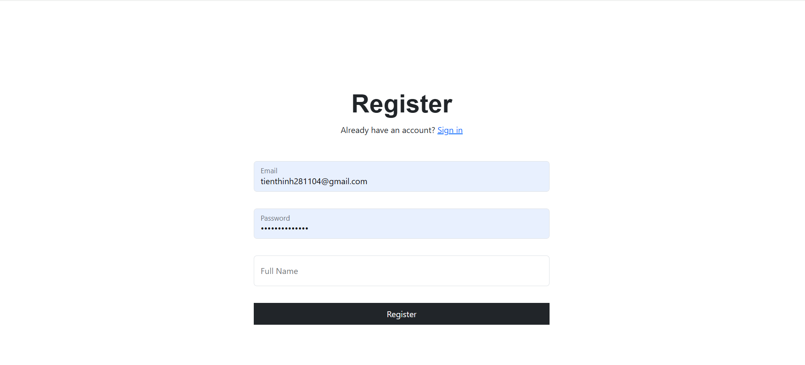
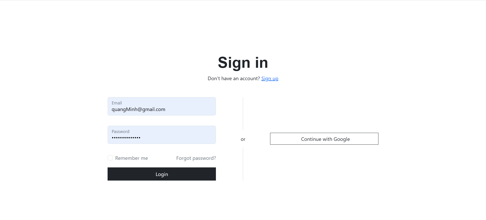

## [Chat me]

## MÔ TẢ HỆ THỐNG

Hệ thống **ChatMe** được xây dựng theo mô hình **client–server nhiều tầng**, với mục tiêu hỗ trợ nhắn tin realtime, ổn định và dễ mở rộng.s

Phía **client** là ứng dụng web viết bằng **ReactJS**. Toàn bộ lưu lượng mạng từ client được điều hướng thông qua **Nginx**, đóng vai trò *gateway* và *reverse proxy*. Tại đây, Nginx phân chia luồng dữ liệu:

- Các request REST như `/api/...` được chuyển tiếp đến **backend Spring Boot**.
- Các kết nối WebSocket tại `/connection/websocket` được proxy trực tiếp đến **Centrifugo**, server chuyên xử lý realtime.

**Backend Spring Boot** đảm nhiệm toàn bộ phần nghiệp vụ của hệ thống: xác thực người dùng, quản lý phòng chat, xử lý gửi/nhận tin nhắn, upload file và lưu trữ dữ liệu vào **MySQL**. Khi có tin nhắn mới hoặc sự kiện realtime, backend sử dụng **HTTP API** để publish sự kiện sang Centrifugo.

**Centrifugo** là thành phần chịu trách nhiệm realtime. Centrifugo sử dụng **Redis** làm *Pub/Sub engine* để quản lý kết nối WebSocket, trạng thái người dùng (presence), danh sách subscriber và phân phối tin nhắn đến các client đang kết nối. Nhờ kiến trúc dựa trên Go và mô hình pub/sub qua Redis, Centrifugo có khả năng xử lý đồng thời **hàng nghìn kết nối WebSocket và lượng sự kiện lớn** mà không ảnh hưởng đến backend, giúp đảm bảo độ trễ thấp và tính ổn định trong quá trình trao đổi tin nhắn. 

Việc tích hợp **Redis** giúp Centrifugo dễ dàng **mở rộng theo chiều ngang (horizontal scaling)**. Thay vì phụ thuộc vào một server duy nhất, hệ thống có thể triển khai **nhiều instance Centrifugo** chạy song song, tạo khả năng mở rộng linh hoạt và sẵn sàng cho việc phát triển, nâng cấp kiến trúc trong tương lai.

Toàn bộ các thành phần của hệ thống gồm **Frontend React**, **Backend Spring Boot**, **Nginx**, **Centrifugo** và **Redis** đều được triển khai dưới dạng container độc lập và điều phối bằng **Docker Compose**, giúp môi trường phát triển và triển khai trở nên nhất quán, dễ chạy và dễ bảo trì.

**Cấu trúc logic tổng quát:**
```
Client (ReactJS) <--> Nginx <--> Server (Spring Boot) <--> Database / External Services
        ↑                                       |
        |                                       |
        └──────── Realtime từ Centrifugo <------┘
 
```

**Sơ đồ hệ thống:**


---

## CÔNG NGHỆ SỬ DỤNG

| Thành phần | Công nghệ | Ghi chú |
|------------|-----------|---------|
| Server | Java, Maven, Spring Boot | REST API và xử lý nghiệp vụ |
| Client | ReactJS, Axios | Giao tiếp HTTP và WebSocket |
| Gateway | Nginx | Reverse proxy HTTP/WebSocket |
| Realtime | Centrifugo Pro 6.4.0, Redis | WebSocket, presence và Pub/Sub |
| Database | MySQL, Cloudinary | Lưu dữ liệu và tệp phương tiện |
| CDC/Messaging | Kafka, Kafka Connect, Debezium | Đồng bộ thay đổi dữ liệu sang Kafka |
| Giám sát | Prometheus, Grafana | Thu thập metric và hiển thị dashboard |
| Triển khai | Docker Compose | Khởi chạy toàn bộ hệ thống bằng container |

---

## HƯỚNG DẪN CHẠY DỰ ÁN

### 1. Yêu cầu

- Docker Desktop đang chạy.
- Docker Compose v2 (`docker compose`) đã được cài đặt.

### 2. Mở thư mục dự án

Mở terminal tại thư mục `ChatMe` trước khi thực hiện các bước tiếp theo.

### 3. Cấu hình biến môi trường

Tạo `source/.env` từ file mẫu và thay toàn bộ giá trị `change-me` bằng key thực tế:

```bash
cd source
cp .env.example .env
```

Trên PowerShell có thể dùng:

```powershell
cd source
Copy-Item .env.example .env
```

File `.env` chứa mật khẩu và API key nên đã được loại khỏi Git. Không commit file này lên repository.

### 4. Build và khởi động

```bash
cd source
docker compose up -d --build
```

Những lần chạy tiếp theo chỉ cần:

```bash
cd source
docker compose up -d
```

### 5. Địa chỉ dịch vụ

| Dịch vụ | Địa chỉ |
|---------|---------|
| ChatMe qua Nginx | http://localhost:9000 |
| Frontend React | http://localhost:3000 |
| Backend Spring Boot | http://localhost:8081 |
| Backend health | http://localhost:8081/actuator/health |
| Backend metrics | http://localhost:8081/actuator/prometheus |
| Centrifugo | http://localhost:8000 |
| Kafka Connect API | http://localhost:8083 |
| Prometheus | http://localhost:9090 |
| Prometheus targets | http://localhost:9090/targets |
| Grafana | http://localhost:3001 |

Backend dùng cổng host `8081` để tránh xung đột với các dịch vụ thường chạy ở `8080`. Có thể đổi bằng biến `BACKEND_PORT` trong `source/.env`.

### 6. Kiểm tra trạng thái

```bash
docker compose ps
docker compose logs backend
docker compose logs connect-config-loader
```

Hệ thống hoạt động đúng khi:

- Backend health trả về `{"status":"UP"}`.
- MySQL, Kafka và Kafka Connect hiển thị `healthy`.
- `connect-config-loader` kết thúc với mã `0`.
- Connector `chatme-mysql-connector` và task của nó ở trạng thái `RUNNING`.
- Target `chatme-backend` trên Prometheus hiển thị `UP`.

Để dừng hệ thống:

```bash
docker compose down
```

Lệnh trên giữ nguyên dữ liệu trong Docker volumes. Chỉ dùng `docker compose down -v` khi thực sự muốn xóa toàn bộ dữ liệu MySQL, Kafka, Redis và Grafana.

---

## GIÁM SÁT VỚI PROMETHEUS VÀ GRAFANA

Backend cung cấp metric qua Spring Boot Actuator tại `/actuator/prometheus`. Prometheus tự động thu thập endpoint này qua mạng Docker bằng địa chỉ `backend:8080`.

Grafana đã được provision tự động với:

- Data source `Prometheus` trỏ tới `http://prometheus:9090`.
- Dashboard `ChatMe Observability`.
- Quyền truy cập anonymous Admin dành cho môi trường phát triển local.

Sau khi tạo lưu lượng bằng cách sử dụng ChatMe, mở dashboard tại:

http://localhost:3001/d/chatme-observability/chatme-observability

Dashboard hiển thị request rate, HTTP p95 latency, JVM memory và process CPU. Nếu dashboard chưa có dữ liệu, kiểm tra target `chatme-backend` tại http://localhost:9090/targets và xem log:

```bash
docker compose logs prometheus
docker compose logs grafana
```

---

## GIAO TIẾP (GIAO THỨC SỬ DỤNG)

| Endpoint | Protocol | Method | Input | Output |
|----------|----------|--------|--------|--------|
| `/api/auth/register` | HTTP/1.1 | POST | Body: UserCreateRequest | ApiResponse<UserResponse> |
| `/api/auth/login` | HTTP/1.1 | POST | Body: LogInRequest | ApiResponse<SignInResponse> |
| `/api/auth/outbound/authentication?code=...` | HTTP/1.1 | POST | Query: code | ApiResponse<SignInResponse> |
| `/api/auth/logout` | HTTP/1.1 | POST | Body: LogOutRequest | ApiResponse<String> |
| `/api/auth/refresh` | HTTP/1.1 | POST | Cookie: refreshToken | ApiResponse<RefreshTokenResponse> |
| `/api/auth/introspect` | HTTP/1.1 | POST | Body: IntrospectRequest | ApiResponse<IntrospectResponse> |
| `/api/user/getUserById/{userId}` | HTTP/1.1 | POST | Path: userId | ApiResponse<UserResponse> |
| `/api/user/getMyInfo` | HTTP/1.1 | GET | — | ApiResponse<UserResponse> |
| `/api/user/getUserByKeyword?keyword=...` | HTTP/1.1 | GET | Query: keyword | ApiResponse<List<UserResponse>> |
| `/api/centrifugo/connectionToken` | HTTP/1.1 | GET | — | ApiResponse<String> |
| `/api/centrifugo/subcriptionToken?channels=...` | HTTP/1.1 | GET | Query: channels | ApiResponse<String> |
| `/api/centrifugo/isUserOnline/{userId}` | HTTP/1.1 | GET | Path: userId | ApiResponse<Boolean> |
| `/api/centrifugo/getRoomOnlineCount/{roomId}` | HTTP/1.1 | GET | Path: roomId | ApiResponse<Integer> |
| `/api/centrifugo/notifyOnline` | HTTP/1.1 | POST | — | ApiResponse<String> |
| `/api/centrifugo/notifyOffline` | HTTP/1.1 | POST | — | ApiResponse<String> |
| `/api/uploadImage` | HTTP/1.1 | POST | multipart/form-data: file | ApiResponse<UploadResponse> |
| `/api/rooms/{roomId}/messages` | HTTP/1.1 | GET | Path: roomId | ApiResponse<List<MessageResponse>> |
| `/api/rooms/sendMessage` | HTTP/1.1 | POST | Body: MessageRequest | ApiResponse<MessageResponse> |
| `/api/room/listRoom` | HTTP/1.1 | GET | Query: keyword | ApiResponse<List<RoomResponse>> |
| `/api/room/addRoom` | HTTP/1.1 | POST | Body: CreateRoomRequest | ApiResponse<RoomResponse> |
| `/api/rooms/join/{roomId}` | HTTP/1.1 | POST | Path: roomId | ApiResponse<RoomMemberResponse> |
| `/api/rooms/leave/{roomId}` | HTTP/1.1 | POST | Path: roomId | ApiResponse<RoomMemberResponse> |


---

## KẾT QUẢ THỰC NGHIỆM

> Đưa ảnh chụp kết quả hoặc mô tả log chạy thử.
- Trang đăng ký


- Trang đăng nhập


- Trang gửi tin nhắn cá nhân


- Trang gửi tin nhắn nhóm

---

## CẤU TRÚC DỰ ÁN

```
ChatMe/
├── INSTRUCTION.md
└── README.md
├── statics
│   ├── diagram.png
│   └── logo.png
├── source
│   ├── client
│   │   ├── chatme
│   │   │   ├── public
│   │   │   ├── src
│   │   │   │   ├── components
│   │   │   │   │   ├── authentication
│   │   │   │   │   ├── config
│   │   │   │   │   ├── css
│   │   │   │   │   ├── error
│   │   │   │   │   └── pages
│   │   │   │   │       ├── ChatMe
│   │   │   │   │       │   ├── components
│   │   │   │   │       │   └── ChatMePage.jsx
│   │   │   │   │       ├── LoginPage
│   │   │   │   │       │   ├── components
│   │   │   │   │       │   └── LoginPage.jsx
│   │   │   │   │       └── RegisterPage
│   │   │   │   │           ├── components
│   │   │   │   │           └── RegisterPage.jsx
│   │   │   │   ├── context
│   │   │   │   ├── hooks
│   │   │   │   ├── service
│   │   │   │   ├── utils
│   │   │   │   ├── App.css
│   │   │   │   ├── App.js
│   │   │   │   ├── App.test.js
│   │   │   │   ├── index.css
│   │   │   │   ├── index.js
│   │   │   │   ├── setupTests.js
│   │   │   │   └── store.js
│   │   │   ├── .gitignore
│   │   │   ├── Dockerfile
│   │   │   ├── README.md
│   │   │   ├── package-lock.json
│   │   │   ├── package.json
│   │   └── README.md
│   ├── server
│   │   ├── WeChat
│   │   │   ├── src
│   │   │   │   ├── main
│   │   │   │   │   ├── java
│   │   │   │   │   │   └── LapTrinhMang
│   │   │   │   │   │       └── WeChat
│   │   │   │   │   │           ├── Configuration
│   │   │   │   │   │           ├── Controller
│   │   │   │   │   │           ├── Dto
│   │   │   │   │   │           ├── Entity
│   │   │   │   │   │           ├── Enums
│   │   │   │   │   │           ├── Exception
│   │   │   │   │   │           ├── Repository
│   │   │   │   │   │           ├── Service
│   │   │   │   │   │           ├── Utils
│   │   │   │   │   │           ├── Validator
│   │   │   │   │   │           └── WeChatApplication.java
│   │   │   │   │   └── resources
│   │   │   │   │       └── application.yaml
│   │   │   ├── .gitattributes
│   │   │   ├── Dockerfile
│   │   │   ├── docker-compose.dev.test.yml
│   │   │   ├── mvnw
│   │   │   ├── mvnw.cmd
│   │   │   └── pom.xml
│   │   └── README.md
│   ├── nginx
│   │   └── nginx.conf
│   ├── centrifugo
│   │   ├── config.json
│   └── docker-compose.yml
├── .gitignore
```

---

## HƯỚNG PHÁT TRIỂN THÊM

> Ý tưởng mở rộng hoặc cải tiến hệ thống.
- [ ] **Tối ưu hiệu năng:** giảm khóa DB khi nhiều người gửi tin cùng lúc, bổ sung cơ chế retry hoặc optimistic locking để tránh xung đột dữ liệu.
- [ ] **Mở rộng realtime:** hỗ trợ chạy nhiều node Centrifugo, tối ưu presence, thêm tính năng typing indicator và đảm bảo không mất tin nhắn khi server restart.
- [ ] **Scale hệ thống:** nhân bản backend và cấu hình Nginx load balancing; tách lưu trữ file sang dịch vụ riêng (S3/MinIO).
- [ ] **Tăng cường bảo mật:** thêm rate limiting, nâng cấp bảo vệ API và hỗ trợ xác thực hai lớp (2FA).
- [ ] **Bổ sung tính năng:** tìm kiếm tin nhắn, thông báo (notification), và tích hợp gọi thoại/video bằng WebRTC.
